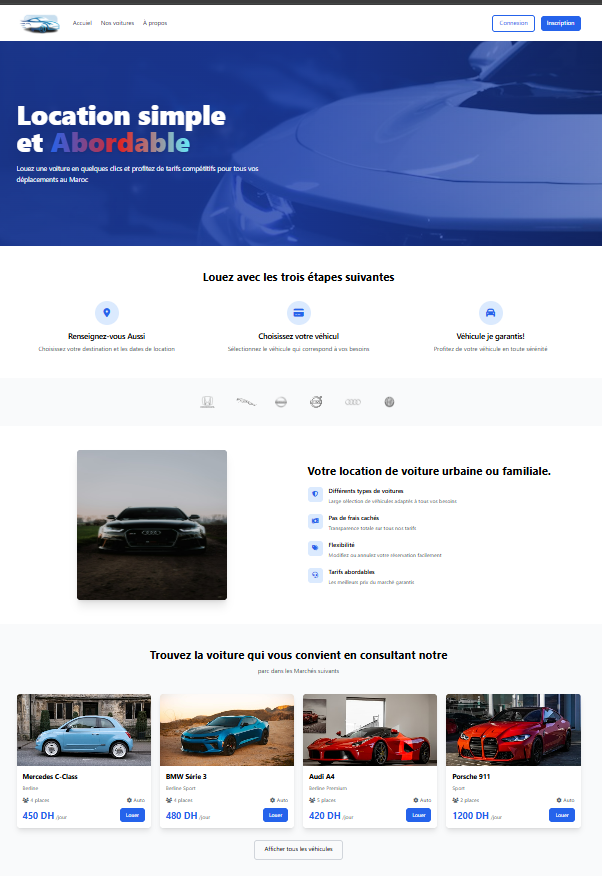
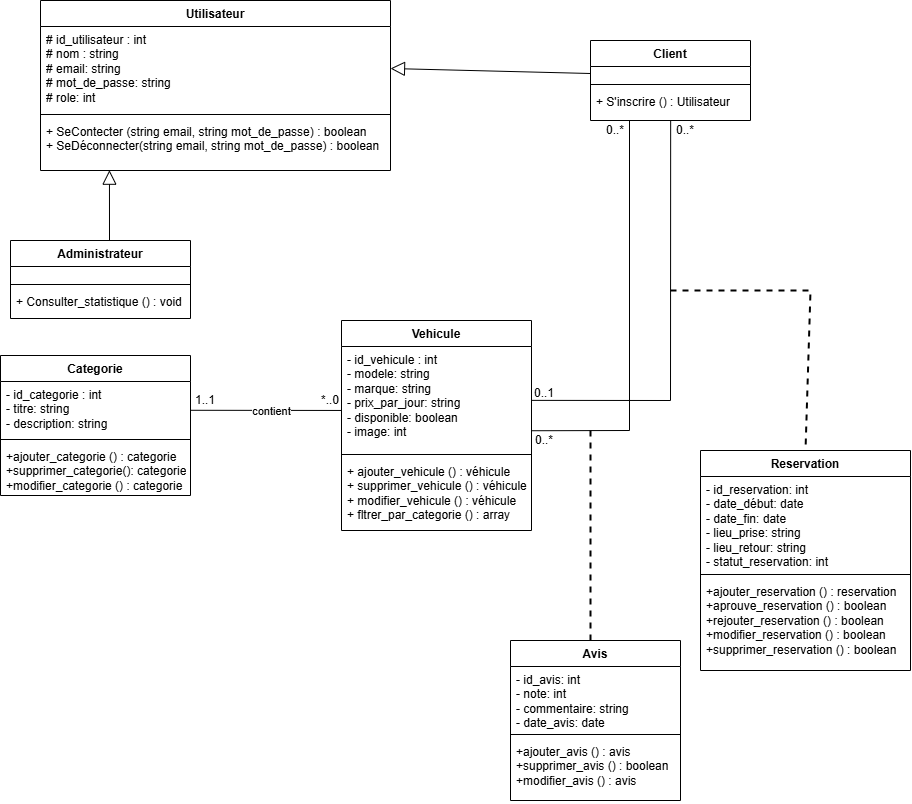

# MaBagnole – Plateforme de gestion de location de voitures

## Présentation du projet
**MaBagnole** est une application web de gestion de location de voitures.  
Elle permet aux **clients** de consulter, rechercher et réserver des véhicules en ligne, et aux **administrateurs** de gérer efficacement les véhicules, catégories, réservations et avis.

Ce projet a été réalisé dans le cadre de la formation **Développeur Web et Web Mobile (2023)**.

---

## Objectifs du projet
- Digitaliser la gestion de location de voitures
- Améliorer l’expérience utilisateur
- Mettre en pratique :
  - PHP orienté objet
  - SQL
  - Conception UML
  - Gestion de projet avec Jira

---

## Acteurs
- **Client**
- **Administrateur**

---

## Technologies et outils utilisés
- **Backend :** PHP (Programmation Orientée Objet)
- **Base de données :** SQL (MySQL / PostgreSQL)
- **Frontend :** HTML, CSS, JavaScript
- **Conception :** UML (Diagramme de cas d’utilisation, Diagramme de classes)
- **Gestion de projet :** Jira
- **Versioning :** Git & GitHub

---

## Page D'accuiel

## Fonctionnalités développées

### Côté Client
- Connexion à la plateforme
- Consultation des véhicules et des catégories
- Recherche et filtrage dynamique
- Réservation de véhicules
- Ajout, modification et suppression logique des avis
- Pagination des véhicules

### Côté Administrateur
- Gestion des véhicules, catégories, réservations et avis
- Ajout en masse
- Tableau de bord avec statistiques

---

## Base de données
- Tables principales :
  - utilisateurs
  - vehicules
  - categories
  - reservations
  - avis
- Relations gérées par clés étrangères
- Respect de l’intégrité des données

---

## Fonctionnalités SQL avancées (EXTRA)
- **Vue SQL : `ListeVehicules`**
  - Combine les informations des véhicules, catégories, avis et disponibilités
- **Procédure stockée : `AjouterReservation`**
  - Permet l’ajout sécurisé d’une réservation

---

## Conception UML
- Diagramme de cas d’utilisation

- Diagramme de classes

Ces diagrammes ont permis de structurer le projet avant la phase de développement.

---

## Gestion du projet
- Planification et suivi des tâches via **Jira**
- Organisation du travail en étapes claires
- Respect des délais du livrable

---

## Perspectives d’amélioration
- Intégration d’un système de paiement en ligne
- Ajout de notifications
- Mise en place d’une API REST
- Amélioration du dashboard administrateur

---

## Réalisé par
- **Nom :** Aziz Abada
- **Année :** 2025 – 2026
